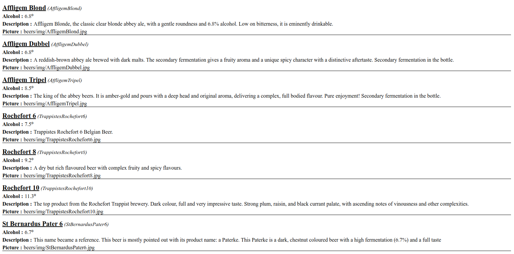

# TP 1 : CSS et feuille de transformation XSLT

## CSS

Commencez par ajouter la déclaration xml qui va bien en tête du fichier
`src/main/resources/beers.xml` : 

    <?xml-stylesheet href="style.css" type="text/css" ?>

Puis créez un fichier `src/main/resources/style.css` pour essayer d'avoir ce résultat : 



## XSLT

Afin de by-passer quelques restrictions de Chrome, je vous encourage à utiliser Firefox.

On va essayer de faire mieux :

Dans `src/main/resources/beers.xml` :

    <?xml-stylesheet type="text/xsl" href="style.xsl" ?>
    
Et retirez : 

    <?xml-stylesheet href="style.css" type="text/css" ?>

Puis créez un fichier `src/main/resources/style.xsl` : 

```xml
<?xml version="1.0" encoding="UTF-8" ?>
<xsl:stylesheet version="1.0" xmlns:xsl="http://www.w3.org/1999/XSL/Transform">
    <xsl:output
            method="html"
            encoding="UTF-8"
            doctype-public="-//W3C//DTD HTML 4.01//EN"
            doctype-system="http://www.w3.org/TR/html4/strict.dtd"
            indent="yes" />
    <xsl:template match="/">
        <html>
            <head>
                <title>Mon premier document XSLT</title>
            </head>
            <body>
                <p>Bonjour !</p>
            </body>
        </html>
    </xsl:template>
</xsl:stylesheet>
```

Itérons sur les bières avec un peu de [Bootstrap 4](https://v4-alpha.getbootstrap.com) pour faire plus joli : 

```xml
<xsl:template match="/">
    <html>
        <head>
            <title>Beer List</title>
            <head>
                <title>Beer List</title>
                <link rel="stylesheet"
                      href="https://maxcdn.bootstrapcdn.com/bootstrap/4.0.0-alpha.6/css/bootstrap.min.css"
                      integrity="sha384-rwoIResjU2yc3z8GV/NPeZWAv56rSmLldC3R/AZzGRnGxQQKnKkoFVhFQhNUwEyJ"
                      crossorigin="anonymous"/>
                <script src="https://code.jquery.com/jquery-3.1.1.slim.min.js"
                        integrity="sha384-A7FZj7v+d/sdmMqp/nOQwliLvUsJfDHW+k9Omg/a/EheAdgtzNs3hpfag6Ed950n"
                        crossorigin="anonymous"/>
                <script src="https://cdnjs.cloudflare.com/ajax/libs/tether/1.4.0/js/tether.min.js"
                        integrity="sha384-DztdAPBWPRXSA/3eYEEUWrWCy7G5KFbe8fFjk5JAIxUYHKkDx6Qin1DkWx51bBrb"
                        crossorigin="anonymous"/>
                <script src="https://maxcdn.bootstrapcdn.com/bootstrap/4.0.0-alpha.6/js/bootstrap.min.js"
                        integrity="sha384-vBWWzlZJ8ea9aCX4pEW3rVHjgjt7zpkNpZk+02D9phzyeVkE+jo0ieGizqPLForn"
                        crossorigin="anonymous"/>
            </head>
        </head>
        <body>
            <xsl:for-each select="beers/beer">
                <p><xsl:value-of select="name" /></p>
            </xsl:for-each>
        </body>
    </html>
</xsl:template>
```

Pour modulariser, on peut utiliser `<xsl:apply-templates select="..." ></xsl:apply-templates>` :

```xml
<xsl:template match="/">
    <html>
        <head>
	    ...
	    </head>
	    <body>
	        <xsl:for-each select="beers/beer">
	            <xsl:apply-templates select="name" />
	        </xsl:for-each>
	    </body>
    </html>			
</xsl:template>

<xsl:template match="name">
    <p><xsl:value-of select="."/></p>
</xsl:template>
```

ou encore : 
```xml
<xsl:for-each select="beers/beer">
    <xsl:apply-templates select="."/>
</xsl:for-each>

...
<xsl:template match="beer">
    <p><xsl:value-of select="name"/></p>
</xsl:template>
```

Puis ajouter des templates pour essayer d'avoir ce résultat :


> ##### Trucs et astuces : 
> Pour les images : 
> 
> ```xml
> <xsl:template match="img">
>     <xsl:element name="img">
>         <xsl:attribute name="class">card-img-top img-fluid</xsl:attribute>
>         <xsl:attribute name="alt"><xsl:value-of select="."/></xsl:attribute>
>         <xsl:attribute name="src">https://raw.githubusercontent.com/Giwi/jquery-beer/master/<xsl:value-of select="."/></xsl:attribute>
>     </xsl:element>
> </xsl:template>
> ```
> 
> Ajouter un espace : 
> 
> ```xml
> <xsl:text>&#xA0;</xsl:text>
> ```

Peut-être pourrions nous conditionner la couleur de la carte au degré d'alcool : 

```xml
<xsl:if test="alcohol &gt; 8">
    <xsl:attribute name="class">card card-inverse text-center card-danger</xsl:attribute>
</xsl:if>
```

## Pour aller plus loin

Il est possible de trier un for-each sur une propriété :

```xml
<xsl:for-each select="beers/beer">
    <xsl:sort select="alcohol" order="ascending" data-type="number" />
</xsl:for-each>
```

## La suite 

Aller zou! direction le [TP 2](../step2).